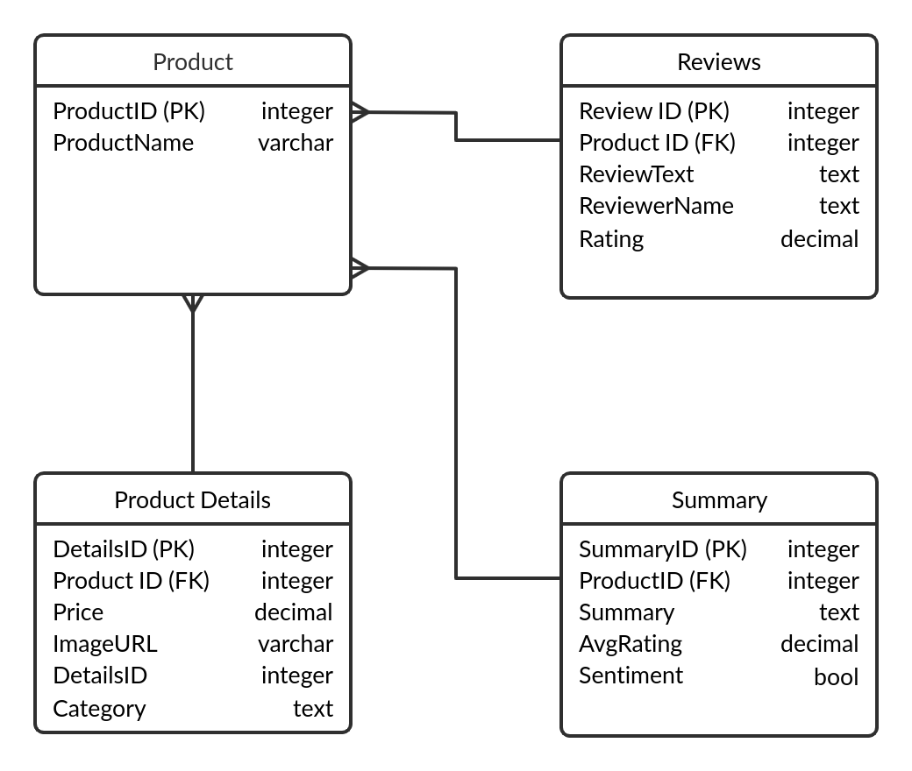
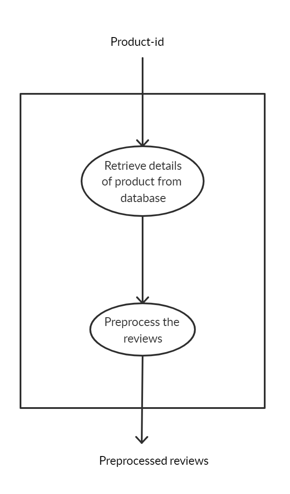
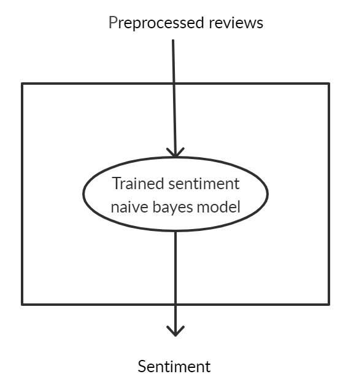
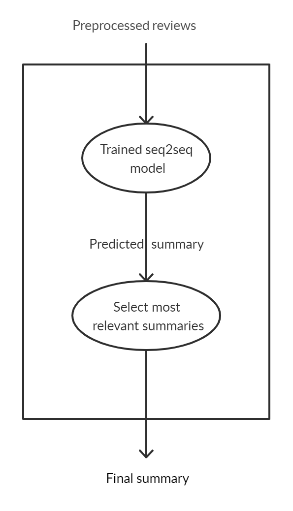
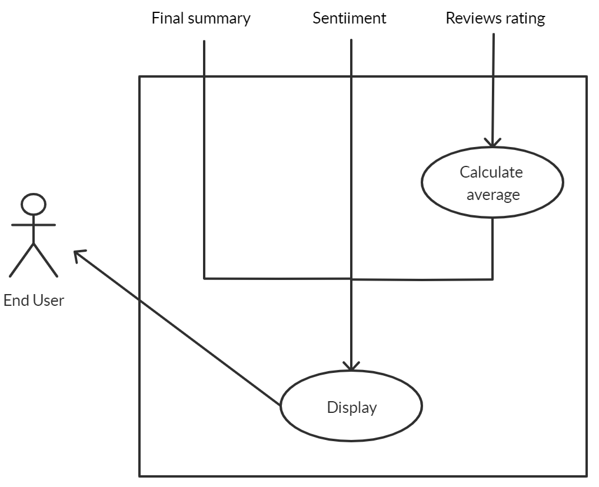
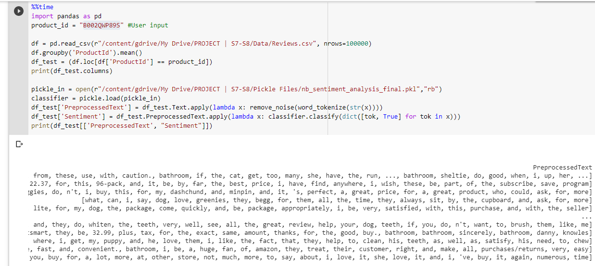

# Abstractive User Review Consolidation

Abstract
---------

E-commerce websites allow customers to leave reviews for various products. There are usually hundreds of reviews for a single product, each review could be lengthy and repetitive. A customer would find it difficult to make a well-informed decision after reading all the reviews. Therefore, automatic review summarization has a huge potential to help customers by providing an authentic summary of the reviews found online on the E-commerce sites. We propose the method of abstractive summarization, which provides more accurate summaries and are closer to human generated summaries. The system also provides the general sentiment of the summaries generated which will help the customers make a decision quickly. The sentiment of the summaries would help the customers know the tone of the text.    

Introduction
============

    Information is always available in plenty in the modern era of the Internet. Anything that happens in any part of the world reaches the other side in the blink of an eye, and hence, access to information is the last thing that you will need to worry about. According to Google Search Engine results stats, around 1 billion articles, posts or information of any kind is released for a single focused keyword every day. And, for a consumer, information available in the web will remain incomprehensible, unless it is transformed in a way that would help them understand the data in the most comprehensive way possible.

    The best way to provide the right amount of information that a user requires is to limit the content into precise and accurate points. Providing the gist of a whole lot of content will reduce the overhead of processing unwanted information for consumers, and the difficulty of providing meaningful data for the providers. This is where summaries find their way into the scenario.

    A summary is a subtle way of representing a lot of information in a minimal form. This seems to be profitable on a lot of platforms. Now, making a summary manually would require the user to read all the content again, which nullifies the sole aim of summaries. This is where an automatic summary generator comes into the picture.

    Automatic summary generators provide you with a summary of the input text that you provide to the system. The automated summary generator can find its application in different forms, in educational fields, content creation, E-commerce, marketing, etc. As long as huge amounts of information needs to be processed in daily life, an automatic summarizer will also be pertinent.

Proposed Project
----------------

### Problem Statement

The existing systems for summarization do not consider the sentiment of the user reviews which are necessary to produce sound reviews of products. Also, some methods consider only a single document for summarization while others do not consider repetition of semantically equivalent words. To overcome these issues, we introduce the system Abstractive User Review Consolidation.

### Proposed Solution

We propose a Sequence to Sequence (Seq2Seq) model with Attention Mechanism which consists of an encoder, decoder, and attention layer to perform abstractive summarization of user reviews. The dataset includes user reviews of products from E-commerce websites. The data from social networking platforms which are sentimentally rich are used to train a Naive Bayes model to identify the sentiment of the review text. We use lemmatization to avoid repetition of semantically equivalent words.
     

Proposed System
---------------

    The existing systems for summarization do not consider the sentiment of the user reviews which are necessary to produce genuine reviews of products. Also, some methods consider only a single document for summarization while others do not consider repetition of semantically equivalent words. To overcome these issues, we introduce the system Abstractive User Review Consolidation.

    We propose a Sequence to Sequence (Seq2Seq) model with Attention Mechanism which consists of an encoder, decoder, and attention layer to perform abstractive summarization of user reviews. The dataset includes user reviews of products from e-commerce websites. The tweets from social networking platforms like Twitter which are sentimentally rich are used to train a Naive Bayes model to identify the sentiment of the review text. We use lemmatization to avoid repetition of semantically equivalent words. The automatic summary is generated out of the reviews received from the e-commerce sites and the repetition of the words are taken into account while creating the summary. The tweets are used to train the model with the sentiment of words that are mostly used in the online space. The proposed system gives a concise summary and sentiment of the reviews and average-rating of the product selected by the user.

Project Scope
-------------

 Automatic text summarization is the task of producing a concise and fluent summary while preserving key information content and overall meaning. With the rise in usage of e-commerce platforms, it is important to provide a concise form of user reviews about the products available online. The web application would also be useful for sellers of the products, making it easier for them to go through customer feedback by going through their products on the application.

 The project aims to create a web application, which can be used to obtain consolidated form of customer reviews of various products available on e-commerce websites. This will help buyers to go through different products and their major pros and cons easily, without having to spend hours reading through all the reviews available. The application would also provide the general sentiment of other buyers,  obtained from the sentiment analysis of the reviews. This would provide the buyer with the percentage of people satisfied and dissatisfied with the product, which would further help in the decision to purchase the product.

### Product Functions

The product aims to implement the following functions:

-   Generate an abstractive summary of the available reviews of the selected product using a trained deep learning model.

-   Determine the general sentiment of the users for the selected product.

-   Compute the average rating of the selected product.

-   Display product data including the name, image and price.

### End Users

-   **Online Shoppers**  
    The application is intended to be used by online shoppers who directly buy goods over the internet. They simply need to have access to the internet and a basic knowledge on using web pages. Increased exposure to technology increases the probability of shopping online and thus using this application.

-   **Manufacturers**  
    This application can also be used by product manufacturers in order to receive the customers opinions and feedback on their product in brief. They may use this data to improve their strategies and to produce better products which satisfies the customers' needs.

### Operating Environment

A hardware device like a smartphone, tablet, laptop or desktop with good internet connectivity is required. The user will interact with the system via a web application. The device used to access the system must run on Linux or Windows Operating System.

### Design and Implementation Constraints

-   The server must run without a time constraint.

-   Increase in number of reviews affects the computational cost for summarization.

-   There may be problems with out-of-vocabulary(OOV) words.

-   The language used in the reviews must be English.

### User Documentation

The system has a simple GUI, so there is no need for additional user documentation. Basic understanding of computers and the internet is sufficient for using this system.

### General Constraints

-   Training of the seq2seq model requires a lot of time depending on the amount of data used.

-   CPU requirements are relatively high and increases with the amount of training data.

-   Training a huge amount of data is infeasible.

-   A stable internet connection is required to use the web application.

### Assumptions and Dependencies

-   The interface of the system will be easy to use and accessible without any time or location constraints.

-   The user must have an updated web browser.

-   The application assumes a stable network connection.

-   The text parsed by the application is assumed to be in English.

External Interface Requirements
-------------------------------

### User Interfaces

The user will interact with the system via a web application. The product name will be selected from an auto-complete drop-down list provided in the homepage. A 'Submit' button will process the input. The output will be displayed as a sweet alert box containing the name, image, price, summary of the reviews, sentiment of the reviews and rating of the product.

### Hardware Interfaces

A hardware device like a smartphone, tablet, laptop or desktop with good internet connectivity is required to access the proposed system through a web browser. No specialised hardware is required.

### Software Interfaces

The web application is programmed in Python with Flask as the framework for the application. React is used as the front end library along with Javascript. Libraries like Keras and Tensorflow would be used for machine learning and deep learning applications i.e., for training and testing various models. Pandas library would be used to manipulate the data for all computations along with the NLTK library for countless natural language processing of the review text.

### Communication Interfaces

The system can be accessed via any popular web browsers like Chrome, Firefox etc. The communication between the application and the web-server will be done using HTTP. The application will send a HTTP request to the web-server. The HTTP POST method will be used to return the response. The web-server returns a HTTP response containing JSON data related to the request.

Hardware and Software Requirements
----------------------------------

### Hardware Requirements

-   System: **CPU - 2.4GHz** (Minimum)
    Model training and generating abstractive summary consumes a lot of system resources. Therefore a server with Clock speed of at least 2.4GHz is required.

-   RAM: **10GB** (Minimum)  
    The system deals with a large amount of memory requirements in order to train the model. Hence a RAM of at least 10GB is required.

-   Hard Disk: **50GB** (or higher)  
    The system deals with a large amount of data. Hence it requires a hard disk of 50GB.

### Software Requirements

-   Operating System: Any operating system (preferably Linux (64-bit), Windows) Linux, Windows is preferred because these are developer friendly, has a powerful shell, flexible and is the most popular.

-   Language
    -   **Python**  
    Python is an interpreted, high-level, general-purpose programming language. It takes very less time to develop. It is typically 3-5 times shorter than other equivalent programming languages. It has powerful polymorphic list and dictionary types, for which rich syntactic support is built straight into the language.

    - **JavaScript** 
    JavaScript, often abbreviated as JS, is a  high-level programming language, often just-in-time compiled, and multi-paradigm. It has curly-bracket syntax, dynamic typing, prototype-based object-orientation, and first-class functions. JavaScript is the programming language of HTML and the Web.

-   Frameworks
    -    **Flask**
    Flask is a python framework used for building the Web interface. Flask is much more fully featured than other frameworks. Python Flask framework supports the use of human-readable website URLs. It also has its own bootstrapping tool. Flask separates a project into individual applications, where Pyramid and Django expect a project to be a single “application” with several views or models.

-   IDE
    -   **Google Colaboratory** 
    Google Colaboratory is a free cloud service by Google and supports free GPU. It provides us with a cloud environment consisting of n1-highmem-2 instance machine type, 2 virtual CPU at 2.2GHz, 13GB RAM and  64GB Free Space. It has an idle cut-off 90 minutes and can be used to run code for free maximum for 12 hours.
    - **Visual Studio Code** 
    Visual Studio Code is a source-code editor developed by Microsoft for Windows, Linux and macOS. It includes support for debugging, embedded Git control, syntax highlighting, intelligent code completion, snippets, and code refactoring.

-   Libraries: 
    -   **pands**
    -   **Tensorflow**
    -   **Keras**
    -   **NLTK**
    -   **React**
    -   **sklearn**
    -   **pickle**
    -   **json**
    -   **numpy**
    -   **BeautifulSoup**
    -   **sweetalert**

System Design
=============

System Architecture
-------------------

The system is divided into 6 phases:

-   **Phase 1** - Training the machine learning models

-   **Phase 2** - Input data

-   **Phase 3** - Data collection

-   **Phase 4** - Data preprocessing

-   **Phase 5** - Summary generation and sentiment analysis

-   **Phase 6** - Output display

### Training the models

There are 2 machine learning models used in the system. One, to produce the summary of reviews and the other, to identify the sentiment of the reviews. A data set containing nearly 6,00,000 reviews of Amazon products and their summaries are fed into a Seq2Seq model with attention mechanism that includes an encoder, a decoder and an attention layer. The data set is used to train the model to produce summary of each review. This trained model is tested with a testing dataset of reviews to check its performance. The model is then stored for use to summarize the required reviews.

The Twitter sentiment analysis dataset, which contains tweets and their associated sentiment is used to train a Naive Bayes model to correctly identify the sentiment of any given sentence. The model is tested with sample sentences to check its accuracy.

### Input Data

In an information system, the input is raw data that is processed to produce the output. The end user inputs the name of the product whose review summary is to be generated. The input is given via an auto-complete drop-down. The name of the product is mapped to its product ID and the same is sent to the next module.

### Data Collection

Data is extracted from the Amazon product database using the product ID. The reviews about the selected product is collected and sent into the next phase which is the preprocessing stage.

### Data Preprocessing

Preprocessing is done to obtain a more digestible form so that the machine learning algorithms can perform better. This phase includes tokenization, stop words elimination, lemmatization, POS tagging and resolution of abbreviations. This cleans up the data and converts it into an integer sequence which the model understands.

### Summary Generation and Sentiment Analysis

Preprocessed data is fed into the trained seq2seq model for summary generation. A summary is generated by the model, which is then given to the web application. The summary generated is an abstractive summary, which generates new phrases and sentences that represent the most important information from the source text. The most relevant summaries are selected to be sent to the web application.

Preprocessed data is also sent to the sentiment analysis model. The percentage of positive and negative sentiment acquired from all the preprocessed reviews is generated and sent to the web application.

### Output Display

The generated summary and the sentiment is sent to the web application. The details are presented to the user through a sweet alert. It contains the name, image, price, summary, rating and sentiment of the selected product.

Data Description
----------------

### Database design

### Use Case Diagram

#### Input Data

#### Search Reviews

#### Preprocessing

#### Sentiment Analysis

#### Summary Generation

#### Output Display

### Class diagram

### Activity Diagram

### Dataset Design

For training the summary generation machine learning model, we to use the Amazon product data[1], an open source dataset composed of millions of amazon reviews. This dataset contains product reviews and metadata from Amazon, including 142.8 million reviews spanning the period from May 1996 - July 2014. It includes reviews (ratings, text, helpfulness votes), product metadata (descriptions, category information, price, brand, and image features), and links to other relevant data (also viewed/also bought graphs).

Twitter is a well-known microblog service that allows public data to be collected via APIs. For training the text sentiment prediction model we make use of the NLTK's twitter corpus currently containing a sample of 20k tweets retrieved from the Twitter Streaming API.

Libraries and Packages Used
---------------------------

- **pandas**
    In computer programming, pandas is a software library written for the Python programming language for data manipulation and analysis. In particular, it offers data structures and operations for manipulating numerical tables and time series. It has intelligent data alignment and integrated handling of missing data.

- **Keras**
    Keras is an open-source neural-network library written in Python. It is capable of running on top of TensorFlow, Microsoft Cognitive Toolkit, R, Theano, or PlaidML. Designed to enable fast experimentation with deep neural networks, it focuses on being user-friendly, modular, and extensible. Keras has strong multi-GPU \& distributed training support.

- **TensorFlow**
    TensorFlow is a free and open-source artificial intelligence software library for dataflow and differentiable programming across a range of tasks. It is a symbolic math library, used for machine learning applications such as to create large-scale neural networks with many layers. It uses data flow graphs to build models. TensorFlow is helpful for Classification, Perception, Understanding, Discovering, Prediction and Creation.

- **sklearn**
    Scikit-learn is a free machine learning library for Python. It features various algorithms like support vector machine, random forests, and k-neighbours. It also supports Python numerical and scientific libraries like NumPy and SciPy. The sklearn library contains a lot of efficient tools for machine learning and statistical modeling including classification, regression, clustering and dimensionality reduction.

- **NLTK**
    NLTK (Natural Language ToolKit) provides a suite of text processing libraries for classification, tokenization, stemming, tagging, parsing, and semantic reasoning like nltk.sent-tokenization, nltk.word-tokenization, nltk.stopwords etc. When compared to other libraries like spacy, genism, scikit-learn, NLTK has many advantages such as fast tokenization, plenty of approaches to each nlp task, and it supports a large number of languages.

- **React**
    React is an open-source Javascript library that is used to build user interfaces. It helps build encapsulated components that manage their own state, then compose them to make complex UIs. React abstracts away the DOM from you, offering a simpler programming model and better performance. 

- **json**
    Python has a built-in package called json, which can be used to work with JSON data. json exposes an API familiar to users of the standard library marshal and pickle modules. The package contains all the functions that will help one use the JSON files and the allied activities.

- **pickle**
    Python pickle module is used for serializing and deserializing a Python object structure. Any object in Python can be pickled so that it can be saved on disk. What pickle does is that it “serializes” the object first before writing it to file. Pickling is a way to convert a python object (list, dict, etc.). The module is used to save trained models in storable formats.

- **numpy**
    NumPy is a library for the Python programming language, adding support for large, multi-dimensional arrays and matrices, along with a large collection of high-level mathematical functions to operate on these arrays.

- **BeautifulSoup**
    Beautiful Soup is a Python package for parsing HTML and XML documents. It creates a parse tree for parsed pages that can be used to extract data from HTML, which is useful for web scraping. It is available for Python 2.7 and Python 3.

- **sweetalert**
    SweetAlert is a package in npm used to create beautiful, responsive and customized alerts in web applications. It gives you different options according to the need.

Module Description
------------------

### Data Collection

-   Amazon product dataset is downloaded for the Seq2Seq summarization model.

-   Dataset of postive and negative tweets available in the NLTK library is downloaded for training sentiment analysis model.

### Preprocessing

-   The dataset is divided into training set and test set.

-   Reviews from the training set and test set are preprocessed.

-   Tokenization of sentences and words is done with the functions in NLTK library.

-   Stop words are removed using the NLTK corpus of stop words.

-   Unnecessary punctuation marks are eliminated.

-   Abbreviations are resolved by replacing them with their full forms.

-   Lemmatization is carried out to obtain the root word with respect to the context.

-   The preprocessed training data is then used for training the model and the preprocessed testing data is used for testing the model.

### Training and Testing the Models

-   The Seq2Seq model with Attention Mechanism is developed by defining its encoder-decoder architecture and the attention layer.

-   The model is trained with the preprocessed review data

-   The model is tested using the preprocessed testing review data.

-   The model is then saved in .h5 format.

-   The Naive Bayes model is trained with the preprocessed Twitter sentiment data.

-   Preprocessed testing review data is then fed into the model to obtain the sentiments.

-   This model is also saved and stored as a pickle file.

### Input Module

-   User Interface is built using React.

-   The input is received through an auto-complete drop-down list.

-   The product name is mapped to the product ID and is sent to the back-end of the application.

### Summary Generation and Sentiment Analysis

-   The product ID is used to retrieve the reviews from the Amazon dataset.

-   The reviews are preprocessed and fed into the summarization model to produce summary of each review.

-   The preprocessed reviews are fed into sentiment analysis model to obtain the sentiment.

-   The most relevant review summaries are returned to the web application along with the sentiment factor.

### Output Display

-   The summary and sentiment along with the basic details of the product is displayed.

-   A sweet alert box is used for the same.

Data Flow Diagram
=================

Level 0 DFD
-----------

Level 1 DFD
-----------

Level 2 DFD
-----------

Implementation
==============

Algorithms
----------

### Algorithm For Input of Product Name

### Algorithm for Data Collection

### Algorithm for Preprocessing

### Algorithm for Training of Seq2Seq Model with Attention Mechanism

### Algorithm for Naive Bayes Sentiment Analysis Model

### Algorithm for Summary Generation

### Algorithm for Sentiment Analysis

Development Tools
-----------------

-   **Google Colaboratory**

    Google Colaboratory is a free cloud service by Google and supports free GPU. It provides us with a cloud environment consisting of n1-highmem-2 instance machine type, 2 virtual CPU at 2.2GHz, 13GB RAM and 64GB Free Space. It has an idle cut-off 90 minutes and can be used to run code for free maximum for 12 hours.

-   **Visual Studio Code**

    Visual Studio Code is a source-code editor developed by Microsoft for Windows, Linux and macOS. It includes support for debugging, embedded Git control, syntax highlighting, intelligent code completion, snippets, and code refactoring.

-   **Git**

    Git is a free and open source distributed version control system designed to handle everything from small to very large projects with speed and efficiency. Compared to other version control systems, Git is responsive, easy to use, and inexpensive (free, actually). Branching allows you to create independent local branches in your code.

-   **Postman**

    Postman is a collaboration platform for API development. Postman's features simplify each step of building an API and streamline collaboration so you can create better APIs faster. It makes it easier for developers to create, share, test and document APIs. This is done by allowing users to create and save simple and complex HTTP/s requests, as well as read their responses.

Testing
=======

Testing Methodologies
---------------------

Software testing methodologies are the various strategies or approaches used to test an application to ensure it behaves and looks as expected. The idea of using various testing methodologies in the development process is to ensure that the software can successfully work in multiple environments and different platforms. Broadly, this is broken down into functional and non-functional testing. In functional testing, the application is tested against business requirements. Non-functional testing methods incorporate all test types focused on the operational aspects of a piece of software. We have performed functional testing part which includes unit testing, integration testing and system testing, each of which is described below.

Unit Testing
------------

Unit testing refers to the testing of individual software modules or components that make up an application or system. It validates that each module of the software performs as designed.

### Input Module

User selects the required product from the drop-down list.By mapping the product name to its corresponding product id, all reviews for the selected product are extracted.

### Preprocessing Module

The review data undergoes tokenization, removal of stop words, POS tagging and lemmatization.

### Model Training

Here, we use a Seq2Seq model with attention mechanism that includes an encoder, decoder and attention layer. Amazon product dataset which contains the product reviews and their summaries are fed into the model to train the model to produce summaries. The model is then tested with a testing dataset of reviews.

### Summary Generation

Preprocessed data is fed into the trained seq2seq model. Model generates an abstractive summary, which is then given to the web application. The web application displays the generated summary along with the sentiment and review rating for the user to view.

Integration Testing
-------------------

Integration testing refers to the testing of the different modules/components that have been successfully unit tested when integrated together to perform specific tasks and activities. The purpose of integration testing is to detect any inconsistencies between the units that are integrated together.

System Testing
--------------

The system testing part of a testing methodology involves testing the complete system for errors and bugs. All modules were integrated at the end of integration testing and the entire system is tested here.

Graphical User Interface
========================

GUI Overview
------------

The user interface is quite simple and straight-forward. The home page gives you the option to select the product from an auto-complete drop-down list. On selecting the product, a sweet alert appears with the summary of the reviews, image, sentiment and rating of the product that was selected.

Main GUI Components
-------------------

The user interface gives you the options to select the product from the auto complete drop-down list.

After selecting the product, the summary is generated along with the rating, sentiment and the image of the product in a sweet alert.

Results
=======

Conclusion
==========

A user review consolidation system has been developed using the method of abstractive summarizing to obtain a concise form of the lengthy product reviews available on e-commerce websites along with additional features such as overall rating and sentiment analysis. The system uses a dataset of fine food reviews from Amazon to generate the summaries. It also generates the general sentiment of the customers towards each product. The average rating based on the numerous reviews available for each product is also calculated.

The sentiment analysis has been performed by training a model based on supervised learning. The Naive Bayes classifier has been chosen as the machine learning model, trained on twitter sentiment analysis data, which provides an accuracy of more than 95%. The abstractive summarizer has been modelled as a Sequence-to-Sequence model which uses attention mechanism to improve accuracy. The model gives fairly good summaries of the reviews.

Future Scope
============

-   The model is trained using reviews for Fine Foods. It can be extended to include other categories of items available online, thereby generating better summaries due to a larger dataset. It can also be improved to integrate reviews from various online shopping websites to provide an unbiased summary and rating.

-   The generalization capability of a deep learning model enhances with an increase in the training dataset size. Web scraping can be introduced to perform summarization on real-time data.

-   Implementing Bi-Directional LSTM which is capable of capturing the context from both the directions could result in a better context vector. The beam search strategy can be applied for decoding the test sequence instead of using the greedy approach (argmax).

-   Pointer-generator networks and coverage mechanisms can be implemented in the model to further improve the summary generation capability of the model.

References
============

1. https://www.kaggle.com/snap/amazon-fine-food-reviews/home

2. Chetana Badgujar, Vimla Jethani and Tushar Ghorpade "Abstractive
Summarization using Graph Based Methods" Proceedings of the 2nd
International Conference on Inventive Communication and Computational
Technologies (ICICCT 2018)

3. Moye Chen, Lei Li, Wei Liu "A Multi-View Abstractive Summarization Model
Jointly Considering Semantics and Sentiment", Proceedings of CCIS2018

4. Tooba Siddiqui, Jawwad Ahmed Shamsi "Generating Abstractive Summaries
Using Sequence to Sequence Attention Model", 2018 International
Conference on Frontiers of Information Technology (FIT)

5. Ranjitha N S, Dr. Jagadish S Kallimani "Abstractive Multi-Document
Summarization"

6. A.Jeyapriya, C.S.Kanimozhi Selvi "Extracting Aspects and Mining Opinions
inProduct Reviews using Supervised Learning Algorithm", IEEE Sponsored
2nd International Conference On Electronics And Communication
Systems(ICECS 2015)

7. Wenbo Nie, Wei Zhang, Xinle Li, Yao Yu "An Abstractive Summarizer Based
on Improved Pointer-Generator Network"

8. Kaichun Yao, Libo Zhang , Dawei Du , Tiejian Luo, Lili Tao, and Yanjun
Wu "Dual Encoding for Abstractive Text Summarization", IEEE Transactions
on Cybernetics

9. Alshaina S, Ansamma John, Aneesh G Nath "Multi-document Abstractive
Summarization Based on Predicate Argument Structure"

10. Farshad Kiyoumarsi "Evaluation Of Automatic Text Summarizations Based On
Human Summaries", 2nd Global Conference on Linguistics and Foreign
Language Teaching LINELT-2014

11. Atif Khan, Naomie Salim, Haleem Farman "Clustered Genetic Semantic Graph
Approach for Multi-document Abstractive Summarization"

12. Shuai Wang, Xiang Zhao, Bo Li, Bin Ge, Daquan Tang "Integrating
Extractive and Abstractive Models for Long Text Summarization", 2017
IEEE 6th International Congress on Big Data

13. Siddhartha Banerjee, Prasenjit Mitra, Kazunari Sugiyama "Multi Document
Abstractive summarization using ILP Based Multi Sentence Compression"

14. Alexander M. Rush, Sumit Chopra, Jason Weston "A Neural Attention Model
for Abstractive Sentence Summarization", Proceedings of the 24th
International Joint Conference on Artificial Intelligence (IJCAI-2015)

15. Jianwei Niu, Huan Chen, Qingjuan Zhao, Limin Sun†, Mohammed Atiquzzaman
"Multi-Document Abstractive Summarization using Chunk-graph and
Recurrent Neural Network", IEEE ICC 2017 SAC Symposium Big Data
Networking Track

16. Hao Xu, Yanan Cao, Ruipeng Jia, Yanbing Liu, Jianlong Tan "Sequence
Generative Adversarial Network for Long Text Summarization", 2018 IEEE
30th International Conference on Tools with Artificial Intelligence

17. Harsha Dave, Shree Jaswal "Multiple Text Document Summarization System
usingnHybrid Summarization Technique", 2015 1st International Conference
on Next Generation Computing Technologies

18. Jagbir Kaur, Meenakshi Bansal "Multi-Layered Sentiment Analytical Model
for Product Review Mining", 2016 Fourth International Conference on
Parallel, Distributed and Grid Computing